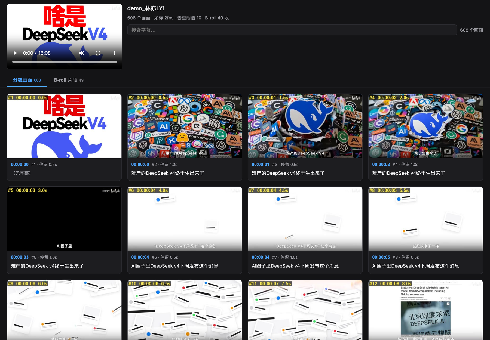
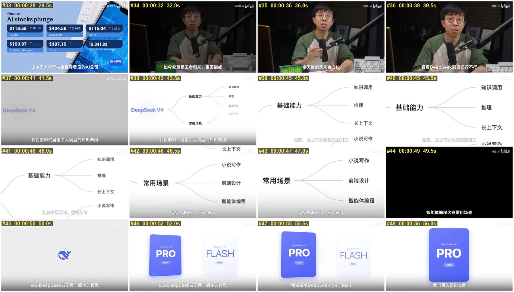

<div align="center">

# cutmap

**把任意视频变成可浏览、可搜索的分镜表，并自动切出 B-roll 片段。**

[](README.md)
[](README.en.md)
[](https://pypi.org/project/cutmap/)
[](https://github.com/xykong36/cutmap/actions/workflows/ci.yml)
[](LICENSE)
[](https://www.python.org)
[](#)

</div>

给它一个视频和一份字幕，得到一个单页 HTML：左边是原片播放器，右边是每一个不同的画面，
每张配着当时说的话。点任意画面，播放器跳到那一刻；搜字幕，定位到对应画面。

```bash
cutmap 视频.mp4 --srt 字幕.srt
open 视频/浏览.html
```

全程本地 `ffmpeg` + `Pillow`，**不调模型、不要 API key、不联网**。



<sub>演示素材：[@林亦LYi](https://www.youtube.com/@lyi) [《一个视频搞懂 DeepSeek V4！》](https://www.youtube.com/watch?v=WDQjRzVcX-A)，版权归原作者所有</sub>

---

## 为什么不是「每隔 N 秒截一张」

固定间隔采样既冗余又漏内容：口播段落 30 秒画面不动，会截出十张一样的图；
快剪蒙太奇 3 秒切 5 个镜头，只截到 1 张。

cutmap 换了个问法——不问「隔多久截一张」，而是问**「哪些画面彼此不同」**：

```
密集采样  →  逐帧算感知哈希  →  与上一张保留帧比差异
                             →  差异够大才留
```

静止段落自动坍缩成一张，画面一变就留一张。

### 为什么不用 ffmpeg 自带的场景检测

`select='gt(scene,0.3)'` 只识别**硬切**，两类内容它抓不到：

1. **低对比度切换** —— 白底 PPT 切白底网页。整体亮度结构相近，差异分永远够不到阈值。
2. **镜头内的内容演进** —— 文字逐行出现、图表动画增长、表格高亮移动。
   按任何定义都不算「切镜头」，但视觉上确实是不同画面。

实测同一个 16 分钟视频：场景检测得 **104** 个画面，感知去重得 **608** 个。
其中一段 25 秒被场景检测判为「单个镜头」，实际包含 3 个完全不同的页面。


### 算法的一个盲区

dHash 比较的是**相邻像素之间的明暗关系**，衡量的是空间结构而非颜色。
两张不同的纯色图会产生完全相同（全 0）的指纹，无法区分。
因此大面积纯色或接近全黑的素材，去重会比预期更激进。

转场卡的识别之所以走亮度均值而不是哈希，也是这个原因。

---

## 安装

```bash
pip install cutmap
```

需要系统 `PATH` 里有 **ffmpeg**：

```bash
brew install ffmpeg          # macOS
apt install ffmpeg           # Debian / Ubuntu
```

---

## 使用

```bash
cutmap 视频.mp4                    # 自动找同名 .srt
cutmap 视频.mp4 --srt 字幕.srt
cutmap ./素材目录/                  # 目录内含 源片.mp4 + 字幕.srt
```

产物落在与视频同名的目录里：

```
视频名/
├── frames/            每个不同画面一张，带 #序号 时间码 秒数 标注
├── sheet_01~NN.jpg    4×4 图墙，适合几张图扫完整片
├── index.json         画面时间戳 + 对齐字幕（可供其他程序消费）
├── broll/             切出的 B-roll 片段 + broll.json
└── 浏览.html          ← 打开这个
```

### 参数

| 参数 | 说明 |
|---|---|
| `--threshold N` | 画面密度，越小越密：`6` 密 / `10` 默认 / `14` 疏 |
| `--fps N` | 密集采样帧率（默认 2，即最细能分辨 0.5 秒） |
| `--cols/--rows` | 图墙行列（默认 4×4） |
| `--thumb-width` | 缩略图宽度 px（默认 480） |
| `--seg-max N` | B-roll 单段上限秒数（默认 45） |
| `--clip-format` | `mp4`（默认）/ `gif` / `webp` |
| `--no-broll` | 跳过 B-roll 切片 |
| `--no-frames` | 只留图墙，不留单帧 |
| `--terms FILE` | 自定义字幕术语表 |

### 密度怎么选

实测曲线（969 秒视频，2fps 采样得 1936 帧）：

| 阈值 | 保留帧 | 平均间隔 | 适合 |
|---|---|---|---|
| 6 | 892 | 1.1s | 完整还原每一步视觉变化（教程复盘） |
| **10** | **597** | **1.6s** | **默认**，兼顾覆盖与可读 |
| 14 | 463 | 2.1s | 风格研究、快速浏览 |
| 24 | 241 | 4.0s | 只看大结构，接近传统分镜表 |

曲线是平缓的，没有天然分界点 —— 这是**审美选择，不是能算出最优解的技术参数**。

---

## 浏览页

单个自包含 HTML，CSS 和 JS 全部内联，只依赖同目录的图片与片段。两个 Tab：

**分镜画面** —— 每个不同画面配当时的字幕
**B-roll 片段** —— 自动循环播放的片段（观感等同 GIF 墙）


<sub>B-roll 标签页的实际效果：片段自动循环播放，观感等同 GIF 墙，但底层是 MP4（体积仅为 GIF 的 1/24）</sub>

共用能力：

- 顶部内嵌原片播放器，**点任意时间码或画面即跳到该时刻**（本地文件，不联网）
- 字幕实时搜索，匹配的是**归一化后**的文本
  （搜 `DeepSeek` 能命中 ASR 写成 `deep sick` 的画面）
- 超长字幕折叠为 `…展开`
- B-roll 只播放视口内的片段（IntersectionObserver）——
  几十个视频同时解码会卡死浏览器
- 跟随系统深色 / 浅色模式

图墙单独输出，适合用几张图扫完整片：



---

## B-roll 自动识别

三条纯规则把画面分成三类，不需要模型：

| 类别 | 判据 |
|---|---|
| **主镜头** | 跨度超过全片 50% 且反复出现的高度相似画面簇 —— 即固定机位 |
| **转场卡** | 亮度均值低于 8（纯黑）或高于 245（纯白） |
| **B-roll** | 其余 |

某期实测：B-roll 49 段 / 731s (75.5%)，主镜头 39 段 / 217s (22.4%)，
转场 16 段 / 20s (2.1%)。

纯屏幕录制、没有口播机位的视频会优雅降级——找不到主镜头，
全部归为 B-roll，靠 `--seg-max` 保证不会糊成一整坨。

### 片段格式

同一个 9 秒片段：

| 格式 | 体积 | 备注 |
|---|---|---|
| GIF 10fps | 1.96 MB | 只有 256 色，渐变有明显色带 |
| WebP | 0.39 MB | 折中 |
| **MP4** | **0.08 MB** | **默认**，比 GIF 小 24 倍且画质更好 |

页面里 MP4 设 `loop muted`，观感与 GIF 无异。
只有要贴进聊天软件或笔记工具时，才需要 `--clip-format gif`。

---

## 字幕术语归一化

ASR 对专有名词的识别经常面目全非。内置术语表做归一化：

```
大家对deep sick新模型的期待值   →   大家对DeepSeek新模型的期待值
用grock测试                    →   用Grok测试
```

真正的价值在**搜索**：搜 `DeepSeek` 能命中所有被转写成 `deep sick` 的画面。

默认表面向 AI / 科技类内容。可自带词表：

```bash
cutmap 视频.mp4 --terms 我的词表.txt
```

格式是每行一条 `正则 => 替换`，见 [`src/cutmap/terms.txt`](src/cutmap/terms.txt)。

**这是术语归一化，不是校对。** 它修不了断句、语法和低频错词 ——
那些需要大模型，不在本工具范围内。

---

## 踩过的坑

开发过程中遇到的问题，多数**不报错、不崩溃，只是悄悄产出错误结果**：

**正则 `\b` 在中英混排下失效**
中文字符在 Python 里同属 `\w`，`用grock测试` 中 `用` 和 `g` 之间不存在单词边界，
`\bgrock\b` 永远匹配不到。术语表统一改用 `(?<![A-Za-z0-9])…(?![A-Za-z0-9])`。

**纯色帧不能用标准差判定**
黑场转场卡上通常烧录着白色字幕，标准差被拉到 23~33，远高于「纯色」阈值。
应改用亮度均值，且阈值要收紧（`<8`）——
放宽到 `<25` 会把偏暗的正常画面也误判成转场。

**取字幕的时间窗口不能重叠**
若为避免空字幕而加「向前回看」，相邻帧会认领同一条字幕，
跨帧拼接时出现整句重复。故拆成两个字段：
`subtitle`（显示用，允许重复）与 `subtitle_own`（拼接用，严格半开区间）。

**ffmpeg concat 的相对路径按列表文件所在目录解析**
拼图墙的文件列表里必须写绝对路径。

**`-v error` 会吞掉 `showinfo` 的输出**
用 ffmpeg 做统计时若带了 `-v error`，结果会静默全为 0。

**多线程下载在 exFAT 上会写坏文件**（如果你自己抓素材）
预分配后在多个偏移并发写，在 exFAT + USB 上产出「大小正确、内容错误」的文件，
表现为 `moov atom not found`。先下到本机磁盘再搬运即可。

---

## 素材从哪来

cutmap 不做下载，只处理本地文件。

B 站视频可用 [BBDown](https://github.com/nilaoda/BBDown)，
它默认会把字幕混流进 mp4，取出来一并交给 cutmap：

```bash
BBDown <BV号> --skip-ai false
ffmpeg -i 视频.mp4 -map 0:m:language:chi 字幕.srt
cutmap 视频.mp4 --srt 字幕.srt
```

请遵守素材来源平台的服务条款与著作权法律，下载内容仅用于个人学习研究。

---

## 致谢

基于 [ffmpeg](https://ffmpeg.org) 与 [Pillow](https://python-pillow.org) 构建。

特别感谢 UP 主 **[@林亦LYi](https://www.youtube.com/@lyi)**。

本项目最初就是为了研究他视频里的剪辑手法而写的 —— 密集的画面切换、
穿插的信息图与演示动画，正是"每隔 N 秒截一张"这种笨办法处理不了的素材，
也因此逼出了感知去重这个思路。README 里的演示截图取自他的
**[《一个视频搞懂 DeepSeek V4！》](https://www.youtube.com/watch?v=WDQjRzVcX-A)**，仅用于展示本工具的输出效果，
版权归原作者所有。若原作者希望移除，请提 issue，我会立即替换。

| | |
|---|---|
| 素材视频 | <https://www.youtube.com/watch?v=WDQjRzVcX-A> |
| 作者频道 | YouTube <https://www.youtube.com/@lyi> · 哔哩哔哩 <https://space.bilibili.com/4401694> |

## License

MIT
